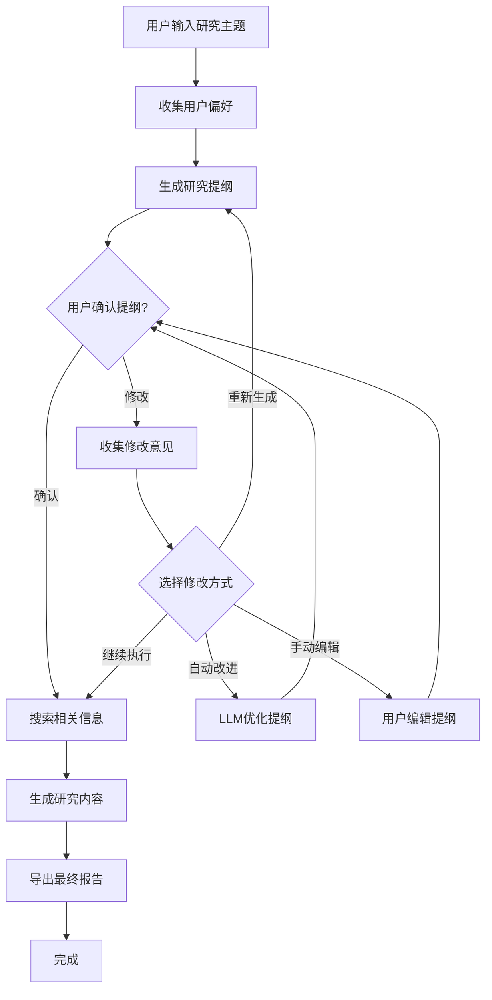

# DeepResearch 交互式功能指南

## 概述

DeepResearch 系统现在支持完整的交互式研究流程，允许用户在关键节点提供反馈和指导，确保研究结果更符合用户期望。

## 🤝 交互模式 vs 自动模式

### 交互模式特点
- 🎯 **用户控制**: 在关键节点征求用户意见
- 🔧 **实时调整**: 支持提纲修改和优化
- 📚 **定制化**: 根据用户偏好调整研究深度和风格
- ✅ **质量保证**: 用户确认后再进行下一步

### 自动模式特点
- ⚡ **高效执行**: 完全自动化，无需等待用户输入
- 🔄 **批量处理**: 适合大量研究任务
- 📊 **标准化**: 使用默认配置和策略
- 🤖 **无人值守**: 可在后台运行

## 🚀 使用方法

### 1. 命令行启动

#### 完全交互模式
```bash
# 最大交互控制
python main.py interactive "人工智能发展趋势"

# 标准交互模式
python main.py research "区块链技术" --interactive
```

#### 自动模式
```bash
# 完全自动化
python main.py auto "量子计算前景"

# 或使用 --auto 参数
python main.py research "机器学习" --auto
```

### 2. 编程接口

#### ResearchWorkflow 交互模式
```python
from workflow.graph import ResearchWorkflow

# 创建交互式工作流
workflow = ResearchWorkflow(
    llm_provider="openai",
    max_sections=5,
    interactive_mode=True
)

# 运行交互式研究
outline, content = await workflow.run_full_workflow("研究主题")
```

#### OutlineAgent 交互模式
```python
from agents.outline_agent import OutlineAgent, OutlineConfig

# 配置交互式 Agent
config = OutlineConfig(
    interactive_mode=True,
    research_depth="comprehensive"
)

agent = OutlineAgent(config=config)
outline = await agent.generate_outline("研究主题")
```

## 📋 交互节点详解

### 1. 研究偏好设置

在研究开始前，系统会询问用户偏好：

```
🎯 研究偏好设置
请设置您的研究偏好:

📊 研究深度:
1. 基础 - 快速概览，3-4个章节
2. 标准 - 平衡深度，4-6个章节
3. 深入 - 全面分析，6-8个章节

📄 输出格式偏好:
1. 学术风格 - 正式、引用丰富
2. 商业风格 - 实用、重点突出
3. 通俗风格 - 易懂、生动有趣

是否包含搜索结果和引用? [Y/n]
研究语言 [zh-CN]:
```

### 2. 提纲确认与修改

生成提纲后，用户可以：

```
📋 请确认研究提纲
==========================================

[显示详细提纲内容]

请选择您的操作:
1. ✅ 确认提纲，继续研究
2. 📝 提供修改意见
3. 🔄 重新生成提纲

请输入选择 (1-3) [1]:
```

### 3. 修改方式选择

当用户选择修改时，可以选择不同的改进方式：

```
🔧 如何修改提纲?
1. 🤖 自动改进 - 让AI根据您的反馈自动优化
2. ✏️ 手动编辑 - 直接编辑内容
3. 🔁 重新生成 - 完全重新生成
4. ⏭️ 继续执行 - 使用当前版本继续

请选择修改方式 (1-4) [1]:
```

## 🔧 配置选项

### 全局配置

在 `config.yml` 中设置默认交互模式：

```yaml
system:
  interactive_mode: true  # 默认启用交互模式
  
workflow:
  max_iterations: 3  # 最大修改迭代次数
  auto_approve_timeout: 30  # 自动批准超时时间（秒）
```

### Agent 特定配置

```python
# OutlineAgent 配置
outline_config = OutlineConfig(
    max_sections=6,
    research_depth="comprehensive",  # basic, standard, comprehensive
    interactive_mode=True,
    include_keywords=True,
    include_estimates=True
)

# ResearchWorkflow 配置
workflow_config = WorkflowConfig(
    llm_provider="claude",
    max_sections=5,
    language="zh-CN",
    interactive_mode=True
)
```

## 📊 交互流程图



## 🎯 最佳实践

### 1. 选择合适的模式

- **重要研究**: 使用交互模式，确保质量
- **批量任务**: 使用自动模式，提高效率
- **探索性研究**: 使用交互模式，灵活调整

### 2. 提供有效反馈

好的反馈示例：
```
请增加"技术挑战"章节，减少历史背景部分，
重点关注实际应用案例和未来发展趋势。
```

避免的反馈：
```
不好，重新写。
```

### 3. 合理设置偏好

- **学术研究**: 选择"深入"深度 + "学术风格"
- **商业报告**: 选择"标准"深度 + "商业风格"
- **科普文章**: 选择"基础"深度 + "通俗风格"

## 🧪 演示和测试

### 运行交互功能演示

```bash
# 完整演示
python examples/interactive_research_demo.py

# 选择特定演示
python examples/interactive_research_demo.py
# 然后选择 1-5 对应不同演示内容
```

### 测试交互功能

```bash
# 测试 UserInteraction 模块
python -c "from utils.user_interaction import get_user_interaction; print('✅ 模块加载成功')"

# 测试交互式工作流
python -c "from workflow.graph import ResearchWorkflow; w = ResearchWorkflow(interactive_mode=True); print('✅ 工作流初始化成功')"

# 测试交互式 Agent
python -c "from agents.outline_agent import OutlineAgent, OutlineConfig; c = OutlineConfig(interactive_mode=True); a = OutlineAgent(config=c); print('✅ Agent 初始化成功')"
```

## 🔍 故障排除

### 常见问题

1. **交互界面显示异常**
   - 确保终端支持 Rich 库的格式化输出
   - 检查终端编码设置（推荐 UTF-8）

2. **用户输入无响应**
   - 检查是否在非交互环境中运行（如 CI/CD）
   - 使用 `--auto` 参数切换到自动模式

3. **配置加载错误**
   - 运行 `python main.py config-validate` 检查配置
   - 使用 `python main.py config-reset --confirm` 重置配置

### 调试模式

```bash
# 启用详细日志
python main.py research "测试主题" --debug --interactive

# 查看日志文件
tail -f deepresearch.log
```

## 📚 API 参考

### UserInteraction 类

```python
class UserInteraction:
    def get_outline_confirmation(self, outline: ResearchOutline) -> Tuple[bool, Optional[str]]
    def get_modification_choice(self, item_type: str) -> str
    def get_manual_outline_edit(self, outline: ResearchOutline) -> Optional[ResearchOutline]
    def get_research_preferences(self) -> Dict[str, Any]
    def show_progress_update(self, message: str, status: str = "info") -> None
    def display_success(self, message: str) -> None
    def display_error(self, message: str) -> None
    def display_warning(self, message: str) -> None
```

### 便捷函数

```python
from utils.user_interaction import get_user_interaction

ui = get_user_interaction()
preferences = ui.get_research_preferences()
approved, feedback = ui.get_outline_confirmation(outline)
```

## 🔮 未来计划

- [ ] 支持中途暂停和恢复研究
- [ ] 添加研究进度可视化
- [ ] 支持多用户协作模式
- [ ] 集成语音交互功能
- [ ] 添加研究模板和预设

---

通过这些交互功能，DeepResearch 能够更好地理解用户需求，生成更符合期望的研究报告。选择合适的模式和提供有效的反馈是获得最佳结果的关键。 